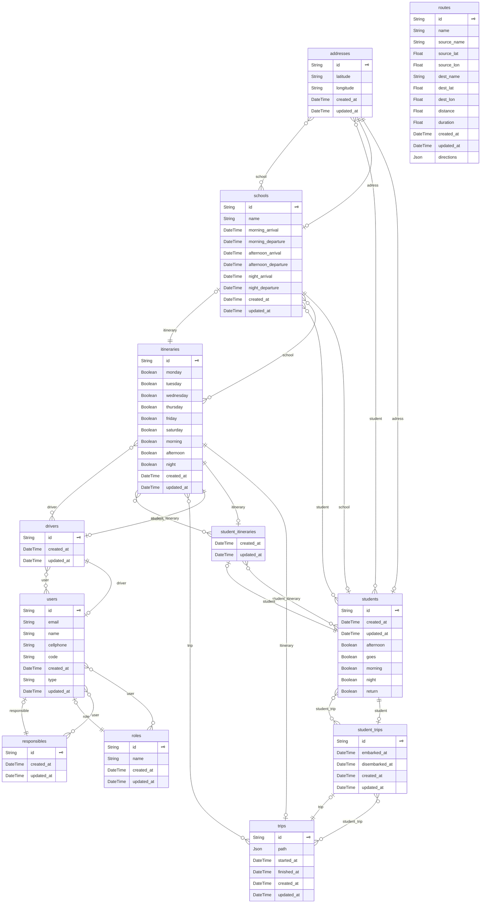

```mermaid
erDiagram

  "addresses" {
    String id "🗝️"
    String latitude 
    String longitude 
    DateTime created_at 
    DateTime updated_at 
    }
  

  "schools" {
    String id "🗝️"
    String name 
    DateTime morning_arrival 
    DateTime morning_departure 
    DateTime afternoon_arrival 
    DateTime afternoon_departure 
    DateTime night_arrival 
    DateTime night_departure 
    DateTime created_at 
    DateTime updated_at 
    }
  

  "users" {
    String id "🗝️"
    String email 
    String name 
    String cellphone 
    String code 
    DateTime created_at 
    String type 
    DateTime updated_at 
    }
  

  "roles" {
    String id "🗝️"
    String name 
    DateTime created_at 
    DateTime updated_at 
    }
  

  "responsibles" {
    String id "🗝️"
    DateTime created_at 
    DateTime updated_at 
    }
  

  "students" {
    String id "🗝️"
    DateTime created_at 
    DateTime updated_at 
    Boolean afternoon 
    Boolean goes 
    Boolean morning 
    Boolean night 
    Boolean return 
    }
  

  "drivers" {
    String id "🗝️"
    DateTime created_at 
    DateTime updated_at 
    }
  

  "itineraries" {
    String id "🗝️"
    Boolean monday 
    Boolean tuesday 
    Boolean wednesday 
    Boolean thursday 
    Boolean friday 
    Boolean saturday 
    Boolean morning 
    Boolean afternoon 
    Boolean night 
    DateTime created_at 
    DateTime updated_at 
    }
  

  "student_itineraries" {
    DateTime created_at 
    DateTime updated_at 
    }
  

  "trips" {
    String id "🗝️"
    Json path 
    DateTime started_at 
    DateTime finished_at 
    DateTime created_at 
    DateTime updated_at 
    }
  

  "student_trips" {
    String id "🗝️"
    DateTime embarked_at 
    DateTime disembarked_at 
    DateTime created_at 
    DateTime updated_at 
    }
  

  "routes" {
    String id "🗝️"
    String name 
    String source_name 
    Float source_lat 
    Float source_lon 
    String dest_name 
    Float dest_lat 
    Float dest_lon 
    Float distance 
    Float duration 
    DateTime created_at 
    DateTime updated_at 
    Json directions 
    }
  
    "addresses" o{--}o "schools" : "school"
    "addresses" o{--}o "students" : "student"
    "schools" o|--|| "addresses" : "adress"
    "schools" o|--|| "itineraries" : "itinerary"
    "schools" o{--}o "students" : "student"
    "users" o|--|| "drivers" : "driver"
    "users" o|--|| "responsibles" : "responsible"
    "users" o|--|| "roles" : "role"
    "roles" o{--}o "users" : "user"
    "responsibles" o{--}o "users" : "user"
    "students" o{--}o "student_itineraries" : "student_itinerary"
    "students" o{--}o "student_trips" : "student_trip"
    "students" o|--|| "addresses" : "adress"
    "students" o|--|| "schools" : "school"
    "drivers" o|--|| "itineraries" : "itinerary"
    "drivers" o{--}o "users" : "user"
    "itineraries" o{--}o "drivers" : "driver"
    "itineraries" o{--}o "schools" : "school"
    "itineraries" o{--}o "student_itineraries" : "student_Itinerary"
    "itineraries" o{--}o "trips" : "trip"
    "student_itineraries" o|--|| "itineraries" : "itinerary"
    "student_itineraries" o|--|| "students" : "student"
    "trips" o{--}o "student_trips" : "student_trip"
    "trips" o|--|| "itineraries" : "Itinerary"
    "student_trips" o|--|| "students" : "student"
    "student_trips" o|--|| "trips" : "trip"
```
