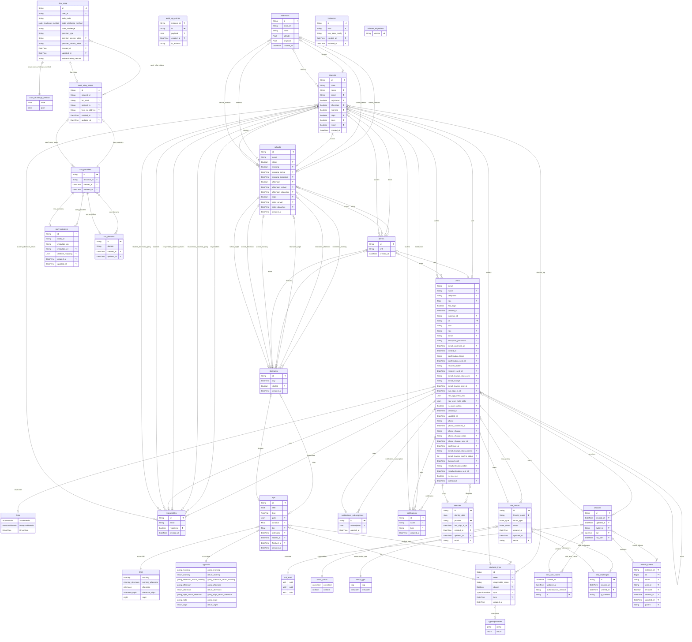

```mermaid
erDiagram

        Role {
            StudentRole StudentRole
ResponsibleRole ResponsibleRole
DriverRole DriverRole
        }
    


        Shift {
            morning morning
morning_afternoon morning_afternoon
afternoon afternoon
afternoon_night afternoon_night
night night
        }
    


        TypeTrip {
            going_morning going_morning
return_morning return_morning
going_afternoon_return_morning going_afternoon_return_morning
going_afternoon going_afternoon
return_afternoon return_afternoon
going_night_return_afternoon going_night_return_afternoon
going_night going_night
return_night return_night
        }
    


        TypeTripStudent {
            going going
return return
        }
    


        aal_level {
            aal1 aal1
aal2 aal2
aal3 aal3
        }
    


        code_challenge_method {
            s256 s256
plain plain
        }
    


        factor_status {
            unverified unverified
verified verified
        }
    


        factor_type {
            totp totp
webauthn webauthn
        }
    
  "addresses" {
    String id "🗝️"
    String place_id 
    String name 
    Float latitude 
    Float longitude 
    DateTime created_at 
    }
  

  "schools" {
    String id "🗝️"
    String name 
    Boolean status "❓"
    Boolean morning "❓"
    DateTime morning_arrival "❓"
    DateTime morning_departure "❓"
    Boolean afternoon "❓"
    DateTime afternoon_arrival "❓"
    DateTime afternoon_departure "❓"
    Boolean night "❓"
    DateTime night_arrival "❓"
    DateTime night_departure "❓"
    DateTime created_at 
    }
  

  "users" {
    String email 
    String name "❓"
    String cellphone "❓"
    Role role "❓"
    Boolean first_login 
    DateTime created_at 
    }
  

  "responsibles" {
    String id "🗝️"
    String email 
    Boolean registered "❓"
    DateTime created_at 
    }
  

  "students" {
    String id "🗝️"
    String code 
    String name "❓"
    String email "❓"
    Boolean registered "❓"
    Boolean afternoon "❓"
    Boolean morning "❓"
    Boolean night "❓"
    Boolean goes "❓"
    Boolean return "❓"
    DateTime created_at 
    }
  

  "drivers" {
    String id "🗝️"
    String cnh 
    DateTime created_at 
    }
  

  "itineraries" {
    String id "🗝️"
    DateTime day 
    Boolean started "❓"
    DateTime created_at 
    }
  

  "trips" {
    String id "🗝️"
    Shift shift 
    TypeTrip type 
    Json path "❓"
    Float duration "❓"
    Float km "❓"
    DateTime estimated "❓"
    DateTime started_at "❓"
    DateTime finished_at "❓"
    DateTime created_at 
    }
  

  "students_trips" {
    String id "🗝️"
    Int order "❓"
    String responsible_name "❓"
    Boolean absent "❓"
    TypeTripStudent type "❓"
    DateTime time "❓"
    DateTime created_at 
    }
  

  "notifications_subscriptions" {
    String id "🗝️"
    Json subscription "❓"
    DateTime created_at 
    }
  

  "notifications" {
    String id "🗝️"
    String name "❓"
    String type "❓"
    DateTime created_at 
    }
  

  "audit_log_entries" {
    String instance_id "❓"
    String id "🗝️"
    Json payload "❓"
    DateTime created_at "❓"
    String ip_address 
    }
  

  "flow_state" {
    String id "🗝️"
    String user_id "❓"
    String auth_code 
    code_challenge_method code_challenge_method 
    String code_challenge 
    String provider_type 
    String provider_access_token "❓"
    String provider_refresh_token "❓"
    DateTime created_at "❓"
    DateTime updated_at "❓"
    String authentication_method 
    }
  

  "identities" {
    String id "🗝️"
    Json identity_data 
    String provider "🗝️"
    DateTime last_sign_in_at "❓"
    DateTime created_at "❓"
    DateTime updated_at "❓"
    String email "❓"
    }
  

  "instances" {
    String id "🗝️"
    String uuid "❓"
    String raw_base_config "❓"
    DateTime created_at "❓"
    DateTime updated_at "❓"
    }
  

  "mfa_amr_claims" {
    DateTime created_at 
    DateTime updated_at 
    String authentication_method 
    String id "🗝️"
    }
  

  "mfa_challenges" {
    String id "🗝️"
    DateTime created_at 
    DateTime verified_at "❓"
    String ip_address 
    }
  

  "mfa_factors" {
    String id "🗝️"
    String friendly_name "❓"
    factor_type factor_type 
    factor_status status 
    DateTime created_at 
    DateTime updated_at 
    String secret "❓"
    }
  

  "refresh_tokens" {
    String instance_id "❓"
    BigInt id "🗝️"
    String token "❓"
    String user_id "❓"
    Boolean revoked "❓"
    DateTime created_at "❓"
    DateTime updated_at "❓"
    String parent "❓"
    }
  

  "saml_providers" {
    String id "🗝️"
    String entity_id 
    String metadata_xml 
    String metadata_url "❓"
    Json attribute_mapping "❓"
    DateTime created_at "❓"
    DateTime updated_at "❓"
    }
  

  "saml_relay_states" {
    String id "🗝️"
    String request_id 
    String for_email "❓"
    String redirect_to "❓"
    String from_ip_address "❓"
    DateTime created_at "❓"
    DateTime updated_at "❓"
    }
  

  "schema_migrations" {
    String version "🗝️"
    }
  

  "sessions" {
    String id "🗝️"
    DateTime created_at "❓"
    DateTime updated_at "❓"
    String factor_id "❓"
    aal_level aal "❓"
    DateTime not_after "❓"
    }
  

  "sso_domains" {
    String id "🗝️"
    String domain 
    DateTime created_at "❓"
    DateTime updated_at "❓"
    }
  

  "sso_providers" {
    String id "🗝️"
    String resource_id "❓"
    DateTime created_at "❓"
    DateTime updated_at "❓"
    }
  

  "users" {
    String instance_id "❓"
    String id "🗝️"
    String aud "❓"
    String role "❓"
    String email "❓"
    String encrypted_password "❓"
    DateTime email_confirmed_at "❓"
    DateTime invited_at "❓"
    String confirmation_token "❓"
    DateTime confirmation_sent_at "❓"
    String recovery_token "❓"
    DateTime recovery_sent_at "❓"
    String email_change_token_new "❓"
    String email_change "❓"
    DateTime email_change_sent_at "❓"
    DateTime last_sign_in_at "❓"
    Json raw_app_meta_data "❓"
    Json raw_user_meta_data "❓"
    Boolean is_super_admin "❓"
    DateTime created_at "❓"
    DateTime updated_at "❓"
    String phone "❓"
    DateTime phone_confirmed_at "❓"
    String phone_change "❓"
    String phone_change_token "❓"
    DateTime phone_change_sent_at "❓"
    DateTime confirmed_at "❓"
    String email_change_token_current "❓"
    Int email_change_confirm_status "❓"
    DateTime banned_until "❓"
    String reauthentication_token "❓"
    DateTime reauthentication_sent_at "❓"
    Boolean is_sso_user 
    DateTime deleted_at "❓"
    }
  
    "addresses" o|--|o "students" : "student"
    "addresses" o|--|o "schools" : "school_address"
    "addresses" o|--|o "schools" : "school_default"
    "schools" o{--}o "addresses" : "address"
    "schools" o{--}o "addresses" : "default_location"
    "schools" o|--|o "drivers" : "driver"
    "schools" o{--}o "itineraries" : "itineraries_morning"
    "schools" o{--}o "itineraries" : "itineraries_afternoon"
    "schools" o{--}o "itineraries" : "itineraries_night"
    "schools" o{--}o "students" : "student"
    "users" o|--|o "Role" : "enum:role"
    "users" o{--}o "drivers" : "driver"
    "users" o{--}o "students" : "student"
    "users" o{--}o "responsibles" : "responsible"
    "users" o{--}o "notifications" : "notification"
    "users" o{--}o "notifications_subscriptions" : "notification_subscription"
    "users" o|--|| "users" : "users"
    "responsibles" o|--|o "users" : "user"
    "responsibles" o{--}o "students" : "students"
    "responsibles" o{--}o "students" : "student_absences_going"
    "responsibles" o{--}o "students" : "student_absences_return"
    "students" o{--}o "addresses" : "address"
    "students" o|--|o "schools" : "school"
    "students" o|--|o "drivers" : "driver"
    "students" o|--|o "users" : "user"
    "students" o{--}o "responsibles" : "responsibles"
    "students" o{--}o "students_trips" : "student_trip"
    "students" o{--}o "notifications" : "notification"
    "students" o|--|o "responsibles" : "responsible_absence_going"
    "students" o|--|o "responsibles" : "responsible_absence_return"
    "drivers" o{--}o "itineraries" : "itinerary"
    "drivers" o{--}o "schools" : "school"
    "drivers" o{--}o "students" : "student"
    "drivers" o|--|| "users" : "user"
    "itineraries" o|--|| "drivers" : "driver"
    "itineraries" o|--|o "schools" : "school_morning"
    "itineraries" o|--|o "schools" : "school_afternoon"
    "itineraries" o|--|o "schools" : "school_night"
    "itineraries" o{--}o "trips" : "trips"
    "trips" o|--|| "Shift" : "enum:shift"
    "trips" o|--|| "TypeTrip" : "enum:type"
    "trips" o|--|o "itineraries" : "itinerary"
    "trips" o{--}o "students_trips" : "student_trips"
    "students_trips" o|--|o "TypeTripStudent" : "enum:type"
    "students_trips" o|--|o "students" : "student"
    "students_trips" o|--|o "trips" : "trip"
    "notifications_subscriptions" o|--|o "users" : "user"
    "notifications" o|--|o "users" : "user"
    "notifications" o|--|o "students" : "student"
    "flow_state" o|--|| "code_challenge_method" : "enum:code_challenge_method"
    "flow_state" o{--}o "saml_relay_states" : "saml_relay_states"
    "identities" o|--|| "users" : "users"
    "mfa_amr_claims" o|--|| "sessions" : "sessions"
    "mfa_challenges" o|--|| "mfa_factors" : "mfa_factors"
    "mfa_factors" o|--|| "factor_type" : "enum:factor_type"
    "mfa_factors" o|--|| "factor_status" : "enum:status"
    "mfa_factors" o{--}o "mfa_challenges" : "mfa_challenges"
    "mfa_factors" o|--|| "users" : "users"
    "refresh_tokens" o|--|o "sessions" : "sessions"
    "saml_providers" o|--|| "sso_providers" : "sso_providers"
    "saml_relay_states" o|--|o "flow_state" : "flow_state"
    "saml_relay_states" o|--|| "sso_providers" : "sso_providers"
    "sessions" o|--|o "aal_level" : "enum:aal"
    "sessions" o{--}o "mfa_amr_claims" : "mfa_amr_claims"
    "sessions" o{--}o "refresh_tokens" : "refresh_tokens"
    "sessions" o|--|| "users" : "users"
    "sso_domains" o|--|| "sso_providers" : "sso_providers"
    "sso_providers" o{--}o "saml_providers" : "saml_providers"
    "sso_providers" o{--}o "saml_relay_states" : "saml_relay_states"
    "sso_providers" o{--}o "sso_domains" : "sso_domains"
    "users" o{--}o "identities" : "identities"
    "users" o{--}o "mfa_factors" : "mfa_factors"
    "users" o{--}o "sessions" : "sessions"
    "users" o{--}o "users" : "users"
```
