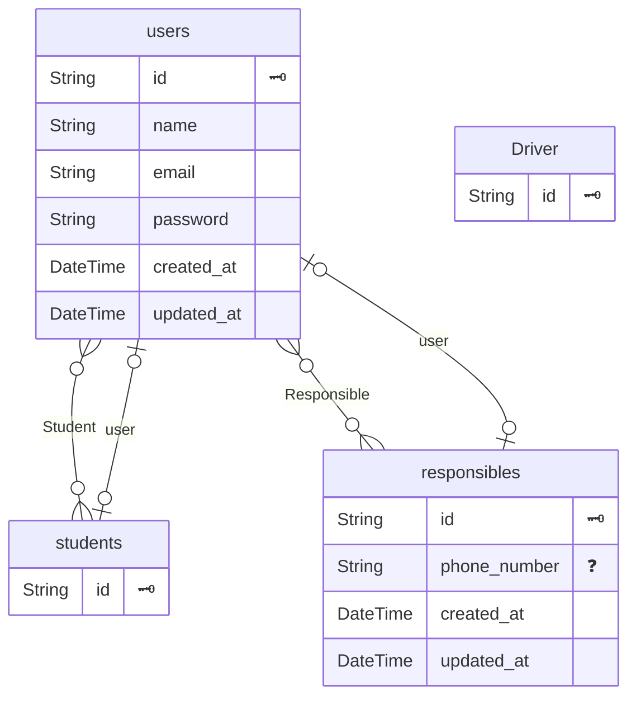

```mermaid
erDiagram

  "users" {
    String id "🗝️"
    String name 
    String email 
    String password 
    DateTime created_at 
    DateTime updated_at 
    }
  

  "students" {
    String id "🗝️"
    }
  

  "responsibles" {
    String id "🗝️"
    String phone_number "❓"
    DateTime created_at 
    DateTime updated_at 
    }
  

  "Driver" {
    String id "🗝️"
    }
  
    "users" o{--}o "students" : "Student"
    "users" o{--}o "responsibles" : "Responsible"
    "students" o|--|o "users" : "user"
    "responsibles" o|--|o "users" : "user"
```
